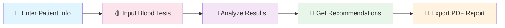

<div align="center">

# 🧪 Medical Supplement Advisor

### *Transform Your Blood Tests Into Personalized Health Insights*


[](https://github.com/WielkiKrzych/medical_supplement_advisor/actions)

**🩸 60+ Blood Parameters • 📊 70+ Supplements • 🎯 Clinical Algorithm • 🌍 i18n Ready**

</div>

---

## 🚀 Quick Start

```bash
git clone https://github.com/WielkiKrzych/medical_supplement_advisor.git
cd medical_supplement_advisor
pip install -r requirements.txt
python src/main.py
```

| 🖥️ **GUI Mode** | 💻 **CLI Mode** |
|:---------------:|:---------------:|
| `python src/main.py` | `python src/main.py --json data.json` |
| Interactive interface | Automation & scripting |

---

## ✨ Features at a Glance

<table>
<tr>
<td width="25%" align="center"><h3>🔬</h3><b>Smart Analysis</b><br><sub>60+ blood parameters<br>Pattern recognition<br>Clinical accuracy</sub></td>
<td width="25%" align="center"><h3>📊</h3><b>Data Management</b><br><sub>Multi-format input<br>70+ supplements<br>Patient profiles</sub></td>
<td width="25%" align="center"><h3>🎨</h3><b>Great UX</b><br><sub>Modern GUI<br>CLI alternative<br>PDF reports</sub></td>
<td width="25%" align="center"><h3>🛡️</h3><b>Quality First</b><br><sub>39 tests passing<br>Type safety<br>CI/CD pipeline</sub></td>
</tr>
</table>

---

## 🩸 Supported Blood Tests

```
┌──────────────┬─────────────────────────────────────────────────────────────┐
│ 📊 Morfologia│ WBC • RDW • Hemoglobina • Erytrocyty • MCV • MCH • Limfocyty │
├──────────────┼─────────────────────────────────────────────────────────────┤
│ 💊 Vitamins  │ D3 • B12 • B9 • C • A • E • K2                              │
├──────────────┼─────────────────────────────────────────────────────────────┤
│ ⚗️ Minerals  │ Żelazo • Ferrytyna • Cynk • Selen • Magnez • Potas          │
├──────────────┼─────────────────────────────────────────────────────────────┤
│ 🦋 Thyroid   │ TSH • FT3 • FT4 • Anty-TG • Anty-TPO                        │
├──────────────┼─────────────────────────────────────────────────────────────┤
│ ❤️ Lipids    │ Cholesterol • HDL • LDL • Trójglicerydy                     │
├──────────────┼─────────────────────────────────────────────────────────────┤
│ 🫀 Liver     │ AST • ALT • GGTP                                             │
├──────────────┼─────────────────────────────────────────────────────────────┤
│ 🍬 Glucose   │ Glukoza • Insulina • HbA1c • HOMA-IR                        │
├──────────────┼─────────────────────────────────────────────────────────────┤
│ 🧬 Hormones  │ Testosteron • DHEAS • SHBG • Estradiol • LH • FSH • Kortyzol│
└──────────────┴─────────────────────────────────────────────────────────────┘
```

---

## 🎯 How It Works



---

## 📂 Project Structure

```
medical-supplement-advisor/
├── 📂 data/          ← Reference data & rules
├── 📂 src/
│   ├── 📂 models/    ← Pydantic data models
│   ├── 📂 core/      ← Business logic
│   ├── 📂 utils/     ← Helper utilities
│   └── 📂 gui/       ← PyQt5 interface
├── 📂 tests/         ← 39 unit tests
└── 📂 examples/      ← Sample data
```

---

## 🗺️ Roadmap

| Version | Status | Features |
|:-------:|:------:|:---------|
| **2.2** | 🚧 In Progress | 🌐 Web Interface • 🌍 English Support • 📊 Enhanced PDF |
| **2.3** | 📋 Planned | 🤖 ML Recommendations • 💊 Drug Interactions • 📱 Mobile App |
| **3.0** | 🔮 Long-term | 🏥 HL7 FHIR • 🩺 Telemedicine API • 🤖 AI Chatbot |

---

## 📋 Changelog (v2.1.1)

### 🔴 Critical Security Fixes
| File | Change |
|:-----|:-------|
| `main_window.py` | Exception details no longer leaked to GUI dialogs |
| `document_parser.py` | Fixed ReDoS-susceptible regex patterns |

### 🟠 High Priority Improvements
| Category | Changes |
|:---------|:--------|
| **Performance** | O(1) lookup dicts in `analyzer.py` & `rule_engine.py` |
| **Safety** | `DataLoader` returns `deepcopy()` to prevent cache mutation |
| **Code Style** | Moved inline imports to module level |
| **Error Handling** | Specific exception types instead of broad `except Exception` |
| **Immutability** | `sorted()` instead of `.sort()` for functional patterns |

### 🟡 Medium & 🟢 Low Priority
- Fixed mutable class-level state in `I18n` singleton
- Corrected fallback logic in `_get_priority_display`
- Added MD5 usage documentation
- Removed unused imports

---

## 🤝 Contributing

```
🍴 Fork → 🌿 Branch → ✏️ Code → ✅ Test → 📤 Push → 🔀 PR
```

---

## 🔗 Links

<div align="center">

| 📦 [Repository](https://github.com/WielkiKrzych/medical_supplement_advisor) | 🐛 [Issues](https://github.com/WielkiKrzych/medical_supplement_advisor/issues) | 📥 [Pull Requests](https://github.com/WielkiKrzych/medical_supplement_advisor/pulls) |
|:----------------------------------------------------------------------------:|:-------------------------------------------------------------------------------:|:--------------------------------------------------------------------------------------:|

</div>

---

<div align="center">

### Made with ❤️ for better health

**⭐ If this project helps you, consider giving it a star! ⭐**

*MIT License — Free to use, modify, and distribute*

</div>
